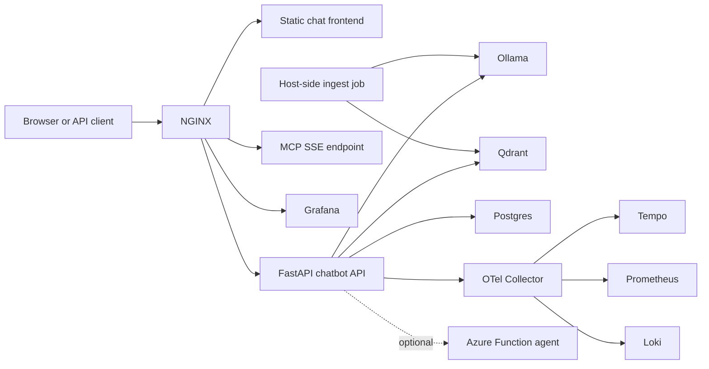

# HDB Chatbot Implementation Guide

This is the practical runbook for the working `hdb-bot` project in this repository.

Use this document when you want to:

- install the stack on a Windows laptop
- understand each service and why it exists
- run the chatbot locally end to end
- re-ingest HDB data
- verify guardrails, observability, and MCP
- push changes to GitHub
- explain the project in an interview

Current GitHub repo:

- `https://github.com/sai-harshita/hdb-bot`

## 1. What This Project Proves

This project demonstrates:

- end-to-end RAG over official HDB sources
- local open-source LLM serving with Ollama
- NeMo-style guardrail checks for input, output, topic control, jailbreak detection, PII masking, and grounding checks
- vector database plus relational database
- FastAPI backend with JWT auth
- NGINX reverse proxy and rate limiting
- MCP server for tool exposure
- OpenTelemetry observability with Grafana, Tempo, Prometheus, and Loki
- Docker Compose orchestration
- GitHub CI/CD scaffolding

## 2. Final Architecture



## 3. Services In This Repo

- `frontend/`
  Static UI served by NGINX.
- `app/`
  FastAPI API, JWT auth, RAG, guardrail runner, telemetry hooks.
- `ingest/`
  HDB crawler and chunk/embed/load job for Qdrant.
- `mcp/`
  FastMCP server exposed over SSE.
- `nginx/`
  Reverse proxy configuration.
- `observability/`
  OTel Collector, Tempo, Prometheus, Loki, Grafana provisioning.
- `.github/workflows/ci.yml`
  CI checks and image build validation.
- `agent/`
  Optional Azure Functions integration point.

## 4. Working Stack Choices

These are the stack choices that are implemented and working in this repo:

- API: `FastAPI`
- Reverse proxy: `NGINX`
- LLM: `Ollama` with `qwen2.5:3b`
- Embeddings: `nomic-embed-text`
- Vector DB: `Qdrant`
- Relational DB: `Postgres`
- Guardrails: `NeMo Guardrails` configuration plus custom guardrail execution path
- PII masking: `Presidio`
- Monitoring: `OpenTelemetry`, `Tempo`, `Prometheus`, `Loki`, `Grafana`
- MCP: `FastMCP` over `SSE`
- Containers: `Docker Compose`

## 5. Important Reality About Hosting

For this exact stack, there are two realistic hosting modes:

1. Local laptop demo
   This is what is fully implemented now. It is the best zero-cost option.

2. Real public always-on deployment
   This requires a Linux VM or other paid compute because Ollama, Qdrant, Postgres, and the observability stack are too heavy for a true free always-on platform.

For a no-cost public demo, the practical route is:

- run the stack locally on your laptop
- expose it temporarily with a tunnel such as Cloudflare Tunnel

For a proper always-on deployment, move the Docker Compose stack to a VM.

## 6. Windows Laptop Prerequisites

This project assumes:

- Windows with WSL2 enabled
- Docker Desktop installed and running
- Git installed
- GitHub CLI optional but recommended
- Python 3 available on the host

Already verified in this workspace:

- Docker Desktop is installed
- Docker engine is running
- WSL2 is available
- GitHub CLI is authenticated

## 7. Repository Setup

If you are setting this up again on a new machine:

```powershell
git clone https://github.com/sai-harshita/hdb-bot.git
cd hdb-bot
Copy-Item .env.example .env
```

Set a real JWT secret in `.env`:

```powershell
$secret = -join ((48..57) + (97..102) | Get-Random -Count 64 | ForEach-Object {[char]$_})
$secret
```

Put that value into:

- `JWT_SECRET=...`

## 8. Start Core Infrastructure

Start the base services first:

```powershell
docker compose up -d ollama qdrant postgres
```

Pull the models:

```powershell
docker compose exec ollama ollama pull qwen2.5:3b
docker compose exec ollama ollama pull nomic-embed-text
```

## 9. HDB Data Ingestion

### Why host-side ingest is used

HDB blocks many HTML page fetches from the Dockerized crawler with `403 Forbidden`.

The same requests work from the Windows host when sent with browser-like headers. Because of that, the reliable ingestion path for this repo is the host-side Python virtual environment:

- `.host_ingest_venv/`

### Create the host ingest environment

```powershell
python -m venv .host_ingest_venv
.host_ingest_venv\Scripts\pip install httpx==0.28.1 beautifulsoup4==4.12.3 pypdf==5.1.0 qdrant-client==1.12.1 langchain-text-splitters==0.3.4
```

### Run ingest

```powershell
$env:OLLAMA_BASE_URL = "http://localhost:11434"
$env:QDRANT_URL = "http://localhost:6333"
.host_ingest_venv\Scripts\python ingest\ingest.py
```

### Verify Qdrant data

```powershell
Invoke-RestMethod http://localhost:6333/collections/hdb_docs | ConvertTo-Json -Depth 6
```

Expected state now:

- collection name: `hdb_docs`
- points count: around `142` with the current source list

## 10. Start The Full Stack

```powershell
docker compose up -d --build
```

This brings up:

- `chatbot-api`
- `mcp-server`
- `otel-collector`
- `tempo`
- `loki`
- `prometheus`
- `grafana`
- `nginx`
- plus the core infra containers already started

## 11. Verify The Running System

### Health

```powershell
Invoke-RestMethod http://localhost/api/healthz
```

Expected:

```json
{"status":"ok"}
```

### Topics

```powershell
Invoke-RestMethod http://localhost/api/topics | ConvertTo-Json -Compress
```

### Login

```powershell
$token = (Invoke-RestMethod -Method Post -Uri http://localhost/api/auth/token -Body @{
  username = "demo"
  password = "demo12345"
}).access_token
```

### Chat

```powershell
Invoke-RestMethod -Method Post -Uri http://localhost/api/chat `
  -Headers @{ Authorization = "Bearer $token" } `
  -ContentType "application/json" `
  -Body '{"message":"Who is eligible to buy a BTO flat as a family?"}' |
  ConvertTo-Json -Depth 6
```

### Chat history

```powershell
Invoke-RestMethod -Method Get -Uri http://localhost/api/chat/history `
  -Headers @{ Authorization = "Bearer $token" } |
  ConvertTo-Json -Depth 6
```

## 12. User-Facing URLs

After startup:

- Frontend: `http://localhost`
- API docs: `http://localhost/docs`
- Grafana: `http://localhost/grafana/`
- MCP SSE endpoint: `http://localhost/mcp/sse`
- Direct Qdrant API: `http://localhost:6333`
- Direct Prometheus: `http://localhost:9090`

## 13. What The Guardrails Layer Actually Does

The running guardrail path in this repo does the following:

- regex-based jailbreak detection
- NeMo-configured input safety prompt
- topic restriction to Singapore HDB questions
- PII masking with Presidio
- grounded answer generation over retrieved HDB context
- NeMo-configured output safety prompt
- NeMo-configured fact-check prompt
- deterministic fallback for key HDB eligibility category pages

Important implementation detail:

- the original NeMo full dialog flow did not produce stable assistant text in this minimal local setup
- the working implementation keeps NeMo-configured checks but uses direct Ollama generation for the grounded answer
- this is more reliable for a laptop-hosted POC and still demonstrates the intended guardrail controls

## 14. MCP Setup

This project exposes HDB tools through FastMCP over SSE.

Live endpoint:

- `http://localhost/mcp/sse`

Current MCP tools:

- `search_hdb_docs`
- `list_hdb_topics`

Important note:

- the originally scaffolded `streamable-http` transport was not supported by the installed `mcp==1.2.0`
- the repo now uses `sse`, which is the working transport for this version

## 15. Observability Setup

The observability stack is fully containerized.

Components:

- `otel-collector`
- `tempo`
- `prometheus`
- `loki`
- `grafana`

Current working checks:

- Grafana health API responds through NGINX
- FastAPI is instrumented with OpenTelemetry
- HTTPX calls are instrumented

Use Grafana for the demo when you want to show:

- traces for chat requests
- metrics collection
- logs routed through the observability stack

## 16. GitHub And CI/CD

The repo is already pushed here:

- `https://github.com/sai-harshita/hdb-bot`

Local workflow:

```powershell
git status
git add -A
git commit -m "Describe the change"
git push origin main
```

CI currently validates:

- Python compile checks
- Docker Compose config validity
- image build coverage

This is enough to demonstrate CI/CD foundations in interviews even if you do not wire a full remote deployment target yet.

## 17. Optional Azure Function Agent

The repo includes an optional Azure Functions agent integration point:

- set `ELIGIBILITY_AGENT_URL` in `.env`

Use this only after the local stack is stable.

Recommended purpose for the Azure function:

- eligibility or grants lookup helper
- structured calculator-style responses
- controlled external action path for agentic demos

## 18. Rebuild Commands You Will Use Often

Rebuild only the API:

```powershell
docker compose up -d --build chatbot-api
```

Reload NGINX after config changes:

```powershell
docker compose exec nginx nginx -t
docker compose exec nginx nginx -s reload
```

Check logs:

```powershell
docker compose logs --tail 100 chatbot-api
docker compose logs --tail 100 nginx
docker compose logs --tail 100 mcp-server
```

Check running containers:

```powershell
docker compose ps
```

## 19. Known Limitations

These are the important current limitations and you should say them clearly:

- The HDB HTML crawl is not reliable from inside Docker because HDB blocks many crawler requests.
- The stable ingest path is host-side, not the Docker `ingest` profile.
- The stack is production-style, but a true public always-on deployment for local Ollama is not realistically free.
- The chatbot is strongest on the curated HDB sources already ingested; broader coverage needs more official page ingestion over time.
- The Azure Functions agent is optional and not required for the local demo.

## 20. Recommended Demo Flow

Use this exact sequence in a demo:

1. Open `http://localhost`
2. Show the architecture and supported topics
3. Sign in with the demo account
4. Ask an HDB eligibility question
5. Show the returned source links
6. Ask an off-topic or jailbreak-style question to show blocking
7. Open Grafana and show the observability layer
8. Show the MCP endpoint and explain how tools can be exposed to external agent clients
9. Show the GitHub repo and CI workflow

## 21. Best Tooling Recommendation For You

If you want the fastest learning path:

- Use `Cursor` as the main coding surface when you want to read files, edit interactively, and learn step by step.
- Use `Codex` for larger implementation passes, repo-wide fixes, debugging, and verification.

That combination is practical:

- Cursor is better for local iterative building.
- Codex is better for autonomous end-to-end repair and validation passes.

## 22. Interview Summary

Use this short summary:

> I built a containerized Singapore HDB RAG assistant with FastAPI, Qdrant, Postgres, Ollama, NGINX, OpenTelemetry, Grafana, and FastMCP. I integrated NeMo-style guardrail checks for safety, jailbreak detection, topic control, PII masking, and grounding checks, and I packaged the whole project with GitHub CI/CD and a production-style architecture.
